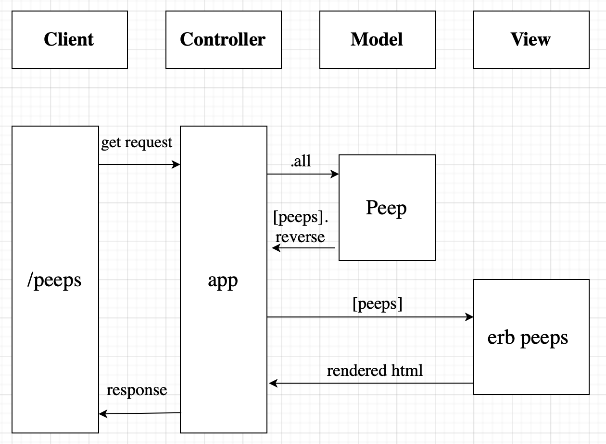

# Chitter

## User stories

```
As a Maker
So that I can let people know what I am doing  
I want to post a message (peep) to chitter
```

```
As a maker
So that I can see what others are saying  
I want to see all peeps in reverse chronological order
```

```
As a Maker
So that I can better appreciate the context of a peep
I want to see the time at which it was made
```

```
As a Maker
So that I can post messages on Chitter as me
I want to sign up for Chitter
```

```
As a Maker
So that only I can post messages on Chitter as me
I want to log in to Chitter
```

```
As a Maker
So that I can avoid others posting messages on Chitter as me
I want to log out of Chitter
```

## Getting started
* `git clone` this repository
* `cd` into it
* Run `bundle install` 

### Database setup
* Connect to `psql`
* Create the database using the command `CREATE DATABASE chitter;`
* Connect to the database using `\c chitter;`
* Run the query in the file `01_create_peeps_table.sql` to create a peeps table 

### To run the chitter app 
```
rackup
```

* Navigate to `localhost:9292/peeps` to view all peeps.

## Tech stack
* Ruby 
* Sinatra
* RSpec
* Capybara
* PostgreSQL
* HTML
* CSS

## Domain model


