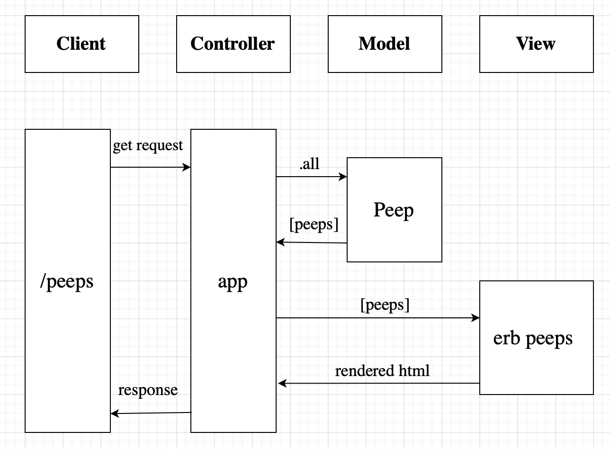

# Chitter
A Twitter clone that allows users to post messages to a public stream.

## Getting started

* install PostgreSQL database management system
* `git clone git@github.com:noarfarber/chitter.git` 
* `cd` into it
* Run `bundle install`
* Run `rake setup`

Following the steps above, you will get a ready-to-go app with RSpec, Sinatra and Capybara installed and two databases: `chitter` (for development environment) and `chitter_test` (for test environment)

### To run the chitter app 
```
rackup
```

Navigate to `localhost:9292` to view all peeps.

## User stories
```
As a Maker
So that I can let people know what I am doing  
I want to post a message (peep) to chitter
```
```
As a maker
So that I can see what others are saying  
I want to see all peeps in reverse chronological order
```
```
As a Maker
So that I can better appreciate the context of a peep
I want to see the time at which it was made
```
```
As a Maker
So that I can post messages on Chitter as me
I want to sign up for Chitter
```
```
As a Maker
So that only I can post messages on Chitter as me
I want to log in to Chitter
```
```
As a Maker
So that I can avoid others posting messages on Chitter as me
I want to log out of Chitter
```

## Tech stack
* Ruby 
* Sinatra
* RSpec
* Capybara
* PostgreSQL
* HTML
* CSS

## Domain model
The user can see all peeps and the time they were created:


